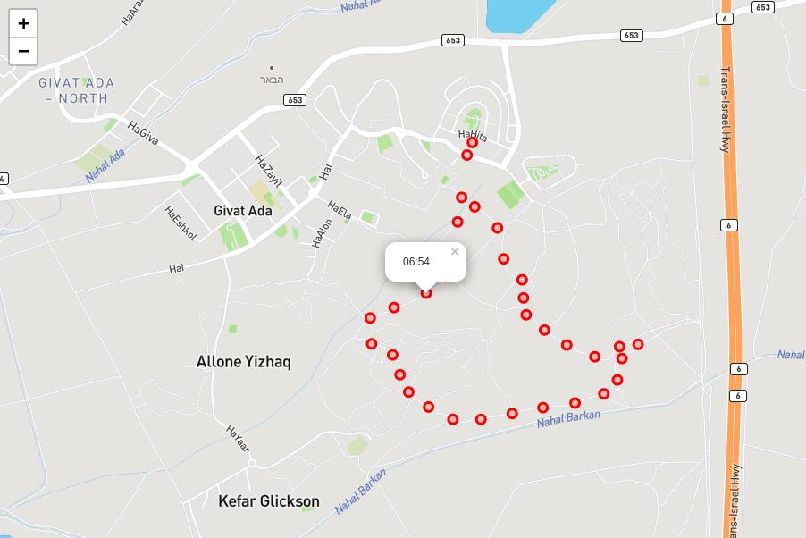

# Plotting Jogging Track on Map - GIS in Go

+++
title = "Plotting Jogging Track on Map - GIS in Go"
date = "FIXME"
tags = ["golang"]
categories = [ "golang" ]
url = "FIXME"
author = "mikit"
+++

You are jogging, and what to show off your route to your friends. The data your have is a CSV output in the following format:

**Listing 1: track.csv**

```
time,lat,lng,height
2015-08-20 03:48:07.235,32.519585,35.015021,136.1999969482422
2015-08-20 03:48:24.734,32.519606,35.014954,126.5999984741211
2015-08-20 03:48:25.660,32.519612,35.014871,123.0
2015-08-20 03:48:26.819,32.519654,35.014824,120.5
2015-08-20 03:48:27.828,32.519689,35.014776,118.9000015258789
2015-08-20 03:48:29.720,32.519691,35.014704,119.9000015258789
2015-08-20 03:48:30.669,32.519734,35.014657,120.9000015258789
```

Listing one shows the start of `track.csv`. Each line contains a time stamp in [UTC](https://en.wikipedia.org/wiki/Coordinated_Universal_Time), [latitude](https://en.wikipedia.org/wiki/Latitude), [longitude](https://en.wikipedia.org/wiki/Longitude) and height above sea level.


_Note:I'm not running at 3am, the times are in UTC and I live in Israel which is two hours ahead. It's early, but not *that* early._

`track.csv` contains 740 rows of data, which is too much to show on a map. The plan is to load the data, then [resample](https://en.wikipedia.org/wiki/Sample-rate_conversion) the data to get fewer points to show and finally show the data on a map by generate HTML that uses [leaflet](https://leafletjs.com/).

Let's start!

**Listing 2: Row struct**

```
22 type Row struct {
23     Time   time.Time `csv:"time"`
24     Lat    float64   `csv:"lat"`
25     Lng    float64   `csv:"lng"`
26     Height float64   `csv:"height"`
27 }
```

Listing 2 shows the `Row` struct that is used by [csvutil](https://pkg.go.dev/github.com/jszwec/csvutil) to parse the CSV file.

**Listing 3: Unmarshaling Time**

```
29 // unmarshalTime unmarshal data in CSV to time
30 func unmarshalTime(data []byte, t *time.Time) error {
31     var err error
32     *t, err = time.Parse("2006-01-02 15:04:05.000", string(data))
33     return err
34 }
```

Listing 3 shows `unmarshalTime` which is used by `csvutil` to parse time in the CSV file. On line 32 we use [time.Parse](https://pkg.go.dev/time#Parse) to parse the time. I always forget how to format the time and find the [constants](https://pkg.go.dev/time#pkg-constants) section in the `time` package documentation helpful.

**Listing 4: Loading CSV**

```
36 // loadData loads data from CSV file, parses time in loc
37 func loadData(r io.Reader, loc *time.Location) ([]Row, error) {
38     var rows []Row
39     dec, err := csvutil.NewDecoder(csv.NewReader(r))
40     dec.Register(unmarshalTime)
41     if err != nil {
42         return nil, err
43     }
44 
45     for {
46         var row Row
47         err := dec.Decode(&row)
48 
49         if err == io.EOF {
50             break
51         }
52 
53         if err != nil {
54             return nil, err
55         }
56 
57         row.Time = row.Time.In(loc)
58         rows = append(rows, row)
59     }
60 
61     return rows, nil
62 }
```

Listing 4 show the `loadData` function that loads data from the CSV. `loadData` gets the CSV as `io.Reader`, which makes it more versatile and also easier to test. It also gets the time zone as parameter since the data in the CSV is in UTC. On line 39 we create a new decoder and on line 40 we register `unmarshalTime` to handle `time.Time` fields. On lines 45 to 59 we iterate over the lines of the file loading them. On line 57 we convert the time from UTC to the right time zone.

**Listing 5: Mean of Rows**

```
65 func meanRow(t time.Time, rows []Row) Row {
66     lat, lng, height := 0.0, 0.0, 0.0
67     for _, row := range rows {
68         lat += row.Lat
69         lng += row.Lng
70         height += row.Height
71     }
72 
73     count := float64(len(rows))
74     return Row{
75         Time:   t,
76         Lat:    lat / count,
77         Lng:    lng / count,
78         Height: height / count,
79     }
80 }
```

Listing 5 shows `meanRow` that takes a slice of `Row` and returns a mean row `Row`. On line 66 we initialize the means to 0, and on lines 67 to 70 we sum the fields. On lines 74 to 79 we return the mean rows with the time and mean value for each field.

Before we take a look at the `resample` function, let's understand what it does. Re-sampling is like a [GROUP BY](https://en.wikipedia.org/wiki/Group_by_(SQL)) statement - we split the data in groups (called `buckets` in the code below) according to some criteria. In our case, we split the data to groups that fall withing a specific time range. Once we grouped the data, for each group we return the group (the time) and a representing row. In the code below we calculate the [mean](https://en.wikipedia.org/wiki/Mean) (sometimes called "average") of each Row field.

Here's an example, say we have the following made up data:

```
time,lat,lng,height
2015-08-20 03:48:07,32.0,42.0,10.0
2015-08-20 03:48:28,33.0,43.0,11.0
2015-08-20 03:48:52,34.0,44.0,12.0
2015-08-20 03:49:09,35.0,45.0,13.0
2015-08-20 03:49:37,36.0,46.0,14.0
```

When we re-sample to minute frequency, we first group the rows:

```
time: 2015-08-20 03:48
2015-08-20 03:48:07,32.0,42.0,10.0
2015-08-20 03:48:28,33.0,43.0,11.0
2015-08-20 03:48:52,34.0,44.0,12.0

time: 2015-08-20 03:49
2015-08-20 03:49:09,35.0,45.0,13.0
2015-08-20 03:49:37,36.0,46.0,14.0
```

Finally, for each group, we return the group (time) average of each field:

```
2015-08-20 03:48,33.0,43.0,11.0
2015-08-20 03:49,35.5,45.5,13.5
```

Back to the code ...

**Listing 6: Re-sampling**

```
82 // resample re-samples rows to freq, using mean to calculate values
83 func resample(rows []Row, freq time.Duration) []Row {
84     buckets := make(map[time.Time][]Row)
85     for _, row := range rows {
86         t := row.Time.Truncate(freq)
87         buckets[t] = append(buckets[t], row)
88     }
89 
90     out := make([]Row, 0, len(buckets))
91     for t, rows := range buckets {
92         out = append(out, meanRow(t, rows))
93     }
94 
95     sort.Slice(out, func(i, j int) bool { return rows[i].Time.Before(rows[j].Time) })
96     return out
97 }
```

Listing 6 shows how we re-sample the rows by time. On line 84 we create a `buckets` which will hold all the rows that fall in the same time span and on lines 85 to 88 we fill these buckets. On line 90 we create the output slice and one lines 91 to 93 we we fill the output slice with the mean rows for each bucket. Finally on line 95 we sort the output by time and return it on line 96.

**Listing 7: HTML template variables**

```
16 var (
17     //go:embed "template.html"
18     mapHTML     string
19     mapTemplate = template.Must(template.New("track").Parse(mapHTML))
20 )
```

Listing 7 shows the HTML template variables. On line 18 we define `mapHTML` string, with an [embed](https://pkg.go.dev/embed) directive above it. On line 19 we define the `mapTemplate` using the `Must` function, the `Must` is used in `var` or `init` and will panic if there's an error in the template.

**Listing 8: The HTML Template**

```
01 <!DOCTYPE html>
02 <html>
03     <head>
04         <title>Miki's Run</title>
05 
06     <link rel="stylesheet" href="https://unpkg.com/leaflet@1.7.1/dist/leaflet.css" integrity="sha512-xodZBNTC5n17Xt2atTPuE1HxjVMSvLVW9ocqUKLsCC5CXdbqCmblAshOMAS6/keqq/sMZMZ19scR4PsZChSR7A==" crossorigin=""/>
07     <script src="https://unpkg.com/leaflet@1.7.1/dist/leaflet.js" integrity="sha512-XQoYMqMTK8LvdxXYG3nZ448hOEQiglfqkJs1NOQV44cWnUrBc8PkAOcXy20w0vlaXaVUearIOBhiXZ5V3ynxwA==" crossorigin=""></script>
08     <style>
09         #track {
10           width: 100%;
11           height: 800px;
12         }
13     </style>
14   </head>
15     <body>
16     <div id="track"></div>
17     <script>
18       var m = L.map('track').setView([{{.start.Lat}}, {{.start.Lng}}], 15);
19       L.tileLayer('https://api.mapbox.com/styles/v1/{id}/tiles/{z}/{x}/{y}?access_token={{.access_token}}', {
20         maxZoom: 18,
21         id: 'mapbox/streets-v11',
22         tileSize: 512,
23         zoomOffset: -1
24     }).addTo(m);
25 
26       {{range .rows}}
27         L.circle([{{.Lat}}, {{.Lng}}], {
28             color: 'red',
29             radius: 20,
30         }).bindPopup('{{.Time.Format "15:04"}}').addTo(m);
31       {{end}}
32     </script>
33     </body>
34 </html>
```

Listing 8 shows `template.html`. On lines 6 & 7 we load leaflet CSS & javascript code. On lines 8-13 we set the dimensions for our map. On line 16 we define the HTML `div` that will hold the map. On line 18 we create the map with initial coordinates and zoom level. On lines 19 to 24 we load the [tiles](https://en.wikipedia.org/wiki/Tiled_web_map) that will be displayed. On lines 26 we iterate over the rows and on lines 27-30 we add a red circle marker with the time as popup. On line 30 we use the [time.Time.Format](https://pkg.go.dev/time#Time.Format) method inside the template to show only hour and minute.


**Listing 9: main function**

```
99 func main() {
100     file, err := os.Open("track.csv")
101     if err != nil {
102         log.Fatal(err)
103     }
104     defer file.Close()
105 
106     loc, err := time.LoadLocation("Asia/Jerusalem")
107     if err != nil {
108         log.Fatal(err)
109     }
110 
111     rows, err := loadData(file, loc)
112     if err != nil {
113         log.Fatal(err)
114     }
115 
116     rows = resample(rows, time.Minute)
117 
118     // Find token in https://account.mapbox.com/access-tokens/
119     accessToken := os.Getenv("MAPBOX_TOKEN")
120     if accessToken == "" {
121         log.Fatal("error: no access token, did you set MAPBOX_TOKEN?")
122     }
123 
124     // Template data
125     data := map[string]interface{}{
126         "start":        rows[len(rows)/2],
127         "rows":         rows,
128         "access_token": accessToken,
129     }
130     if err := mapTemplate.Execute(os.Stdout, data); err != nil {
131         log.Fatal(err)
132     }
133 }
```

Listing 9 shows the main function. On line 100 we open the CSV file and on line 106 we load Israel's time zone. On line 111 we load the data and on line 116 we re-sample it to a minute frequency. Next we generate the map HTML. On line 119 we get the mapbox access token from the environment and on lines 125 to 129 we create the data passed to the HTML template. Finally on line 130 we execute the template on the data to standard output.

**Listing 10: Running the Code**

```
$ go run . > track.html
```

Listing 10 shows how to run the code. When you'll open the generated `track.html` you'll see a map similar to this.



### Conclusion

In about 150 lines of Go and HTML template, we loaded data from CSV, parsed it, re-sampled, and generated an interactive map. You don't have to use fancy geographic tools (called [GIS](https://en.wikipedia.org/wiki/Geographic_information_system)) to show data on maps, using Go to "glue" CSV and leaflet (which uses [OpenStreetMap](https://www.openstreetmap.org/) under the hood) is fun. I encourage you to leaflet more, it's a wonderful library that has [a lot of capabilities](https://leafletjs.com/examples.html).
